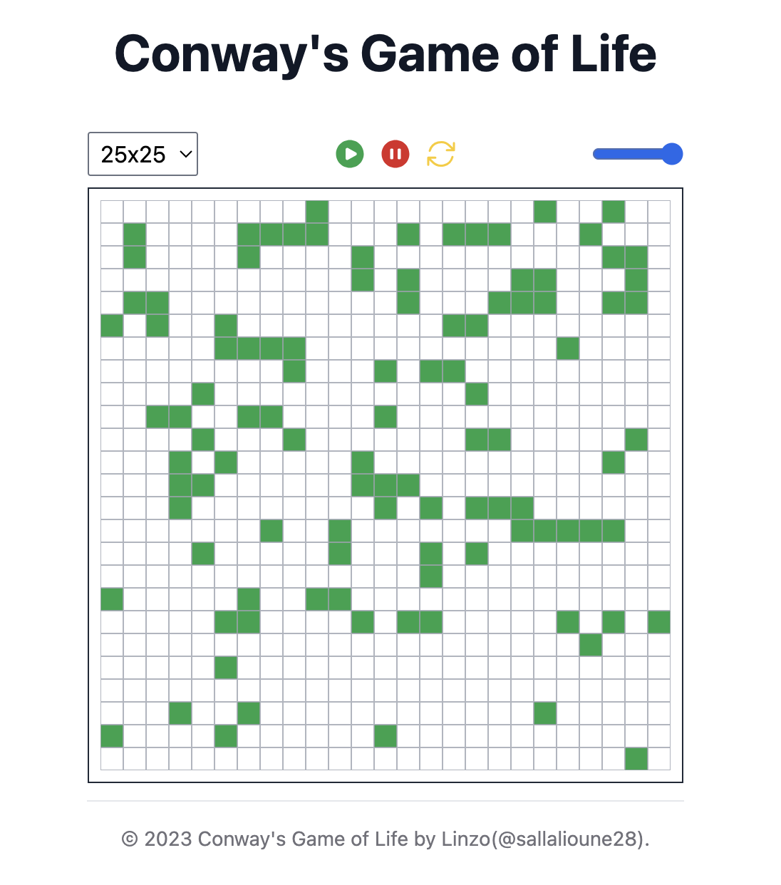
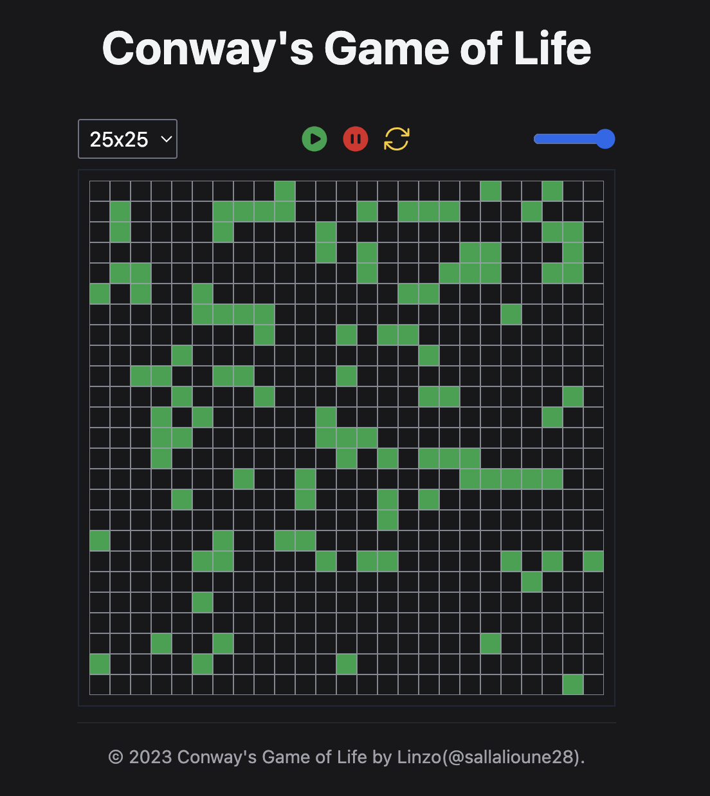

# Conway's Game of Life Implementation

## Overview

This provides an overview of the implementation solution for Conway's Game of Life, from TL221 Challenge. The Game of Life is a cellular automaton devised by the mathematician John Conway, and it's known for its simple yet fascinating rules that govern the evolution of the system.

## Implementation Details

### Language Used

For this Challenge we used **React** to implement the solution.

<table>
  <tbody>
    <tr>
      <td></td>
      <td></td>
    </tr>
  </tbody>
</table>

### Code Structure

```sh
├── README.md      /* The README file */
├── img
│   ├── img1.png
│   └── img2.png
├── index.html     /* HTML entry file */
└── scripts
    ├── main.js    /* Implementation in VanillaJS, only using React for JSX rendering */
    ├── grid.js    /* Another Implementation using fully React */
    └── utils.js   /* Some helper functions */
```

### Rules of Conway's Game of Life

The following are the basic rules that govern the evolution of the system:

- Any live cell with fewer than two live neighbors dies (underpopulation).
- Any live cell with two or three live neighbors survives to the next generation.
- Any live cell with more than three live neighbors dies (overpopulation).
- Any dead cell with exactly three live neighbors becomes a live cell (reproduction).

### Running the Code

To run the Game of Life implementation:

1. Visit this [link](https://linzo99.github.io/life_game/)
2. Clone this repository and run locally

```bash
git clone https://github.com/Linzo99/life_game.git
```

Open the `index.html` if your browser support it or use a [live server](https://www.npmjs.com/package/live-server)
